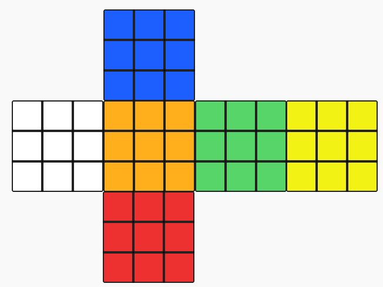

# 코드스쿼드 마스터즈 코스 테스트

## branch step-3 - 루빅스 큐브 구현하기

|      |  Up   |       |      |
| :--: | :---: | :---: | :--: |
| Left | Front | Right | Back |
|      | Down  |       |      |

- 각 면의 index는 위 이미지를 기준으로 다음과 같습니다.
  | 0 | 1 | 2 |
  | :--: | :---: | :---: |
  | 7 | 8 | 3 |
  | 6 | 5 | 4 |
