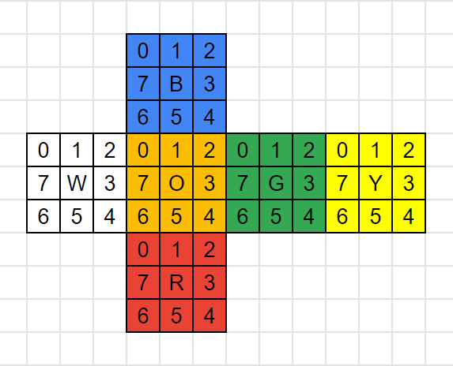
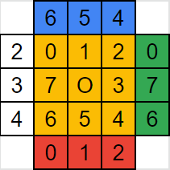

# 코드스쿼드 마스터즈 코스 테스트

## branch step-3 - 루빅스 큐브 구현하기

### 큐브 구현


|      |  Up   |       |      |
| :--: | :---: | :---: | :--: |
| Left | Front | Right | Back |
|      | Down  |       |      |

- 각 면의 index는 위 이미지를 기준으로 다음과 같습니다.
  | 0 | 1 | 2 |
  | :--: | :---: | :---: |
  | 7 | Color | 3 |
  | 6 | 5 | 4 |

- Face 객체는 color를 갖고, pieces를 python deque 로 위와 같은 형태로 표현합니다.

- 이러한 Face 객체를 갖는 RubiksCube를 펼친 전개도를 표현한 이미지는 다음과 같습니다.



- 이런 상황에서 Front 면을 기준으로 예를 들면, 그 이미지는 다음과 같습니다.



- Front 면은 아래부터 시계방향으로 아래 서술하는 면 각각의 모서리 조각들과 맞닿아 있습니다.

  - Down
    - Down 면 기준으로 위 (0 1 2)
  - Left
    - Left 면 기준으로 오른쪽 (2 3 4)
  - Up
    - Up 면 기준으로 아래 (4 5 6)
  - Right
    - Right 면 기준으로 왼쪽 (6 7 0)

- 여기서 Front 면을 회전을 하면, Front 위의 조각이 회전을 하면서 인접한 면의 조각들도 회전하게 됩니다.

  - Front 면의 회전은 deque.rotation() 을 이용하여 바로 구현할 수 있습니다.
  - 인접한 면의 회전은 먼저 이동할 모서리들을 index = 0 으로 이동(rotate)한 후 deque.popleft()를 세번 하여 임시 공간에 저장합니다.
    - 이를 회전 방향에 맞춰 알맞은 위치로 넣습니다. 처음에 popleft를 하여 왼쪽에서 뺐으므로 expendleft()로 넣어주는데, 이 메소드는 list를 뒤집어서 넣으므로 이를 고려하여 넣습니다.
    - 처음 index를 이동했으므로 이를 다시 원래대로 위치시킵니다.

- 이 방법은 모든 면의 조각들의 index가 시계방향으로 증가하는 방향이므로 같은 규칙을 적용할 수 있습니다.

- 이를 코드 상에 일반적으로 적용하기 위해서 adjacency_table을 객체에 shared variable로 저장합니다.

  - Front 면은 Down 위, Left 오른쪽, Up 아래, Right 왼쪽 모서리와 맞닿아 있습니다. 이 모서리 위치는 deque에서 pop 하기 전에 회전시킬 index와도 관련이 있어 정수로 저장합니다.
    - 위 : 0
    - 오른쪽 : 2
    - 아래 : 4
    - 왼쪽 : 6
  - 이런 식으로 저장하면 adjacency_table은 다음과 같습니다. 맞닿은 모서리의 순서는 아래부터 시계방향입니다.

    ```
    {
    "F": {"D": 0, "L": 2, "U": 4, "R": 6},
    "U": {"F": 0, "L": 0, "B": 0, "R": 0},
    "D": {"B": 4, "L": 4, "F": 4, "R": 4},
    "L": {"D": 6, "B": 2, "U": 6, "F": 6},
    "R": {"D": 2, "F": 2, "U": 2, "B": 6},
    "B": {"D": 4, "R": 2, "U": 0, "L": 6},
    }
    ```

- 이러한 adjacency_table을 이용하여 하나의 method를 이용하여 적절하게 큐브를 회전할 수 있습니다.

### 그 외 구현

- 명령어 입력은 step-2의 구현을 그대로 이용하고, 입력 단어 뒤에 2를 갖는 기능을 포함하였습니다.

- 큐브 무작위 섞기는 1~500까지 랜덤 횟수를 얻어 임의의 방향으로 섞습니다.

- 모든 면을 맞추는 것은 Face 객체에서 check()를 이용하여 한면을 확인 할 수 있고, 이를 이용하여 RubiksCube에서 모든 면을 확인하는 check() method로 구현하였습니다.
